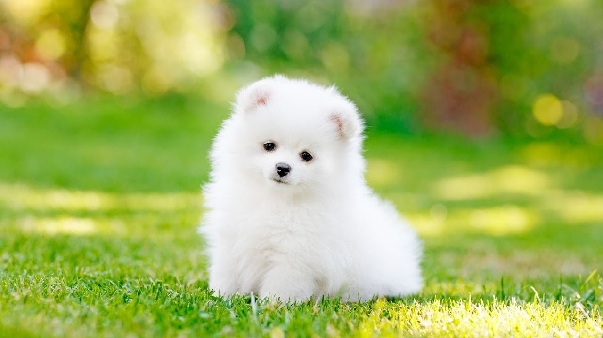

# 
 Dog Breed Prediction 

  

I created a Dog Breed Prediction model as a Image Classification using ResNet50. This Determine the breed of a dog in an image

We can get the  huge Dog Breed Image dataset from Kaggle Dog Breed Identification compitation. Here goal was to create a classifier capable of determining a dog’s breed from a photo. The dataset comprises 120 breeds of dog. The number of dogs in each breed lies between 60 and 130. 

I just created a model in Google Colab to classify the 10 dog breeds 

- Beagle,
- Chihuahua, 
- Doberman,
- French Bulldog,
- Golden_Retriever, 
- Malamute, 
- Pug,
- Saint Bernard, 
- Scottish Deerhound and
- Tibetan Mastiff

I got only few images After extracting these breeds from the Data Set. Then I Augumented existed images to 7K+ by Increasing Brighness, Change in angle, Cropping, and Flipping .  

I used ResNet50 Architecture which includes Conv2d, ReLu Activation Function, Bacth Normalization, Maxpooling AveragePooling and Softmax layers. And I used sparse_categorical_crossentropy as loss function , And Stochastic Gradient Decent as an Optimizer.

I got 100% Training Accuracy and 83% Testing Accuracy by using ResNet50. 

### DataSet:
["Dog Breed Identification”](https://www.kaggle.com/c/dog-breed-identification/data)
